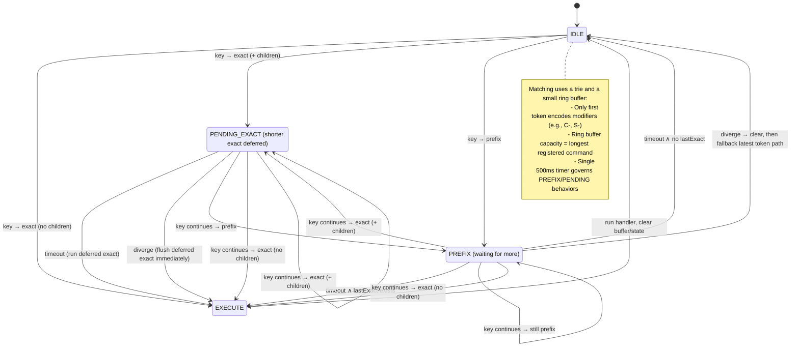

### Introduction

### References
- [Chrome extension example with Rust and WASM](https://dev.to/rimutaka/chrome-extension-with-rust-and-wasm-by-example-5cbh)

## Key sequence state machine (content script)

This extension implements Vim-like key sequences using a small state machine driven by a single timer. States map to `SEQUENCE_STATE` in `extension/js/src/vim_mode.js`.

Legend
- exact: current tokens fully match a command
- has children: the matched command is also a prefix of longer commands
- prefix: current tokens are a valid prefix of one or more commands
- diverge: next key can’t extend the current buffer (no match)

See `extension/js/src/vim_mode.js` for the implementation:
- `SEQUENCE_STATE` enum-like object
- Single timer: `seqTimerId`
- State & handler slots: `seqState`, `seqHandler`
- Buffer & matcher: ring buffer + trie (`attemptMatchFromRing`)

Tip: GitHub renders Mermaid diagrams in README. In VS Code, use the built-in Markdown preview or a Mermaid/Markdown preview extension if needed.
